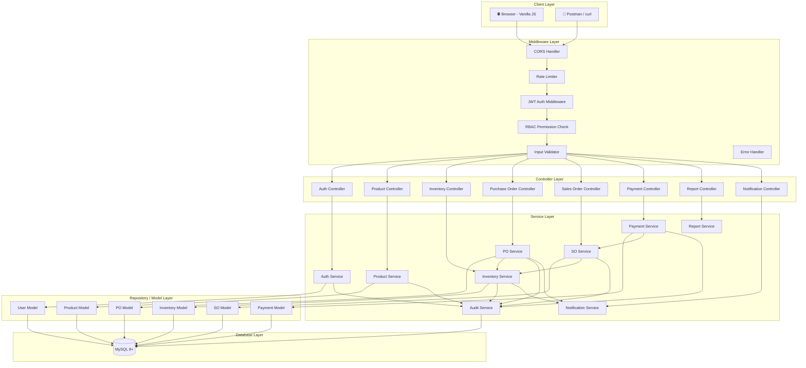
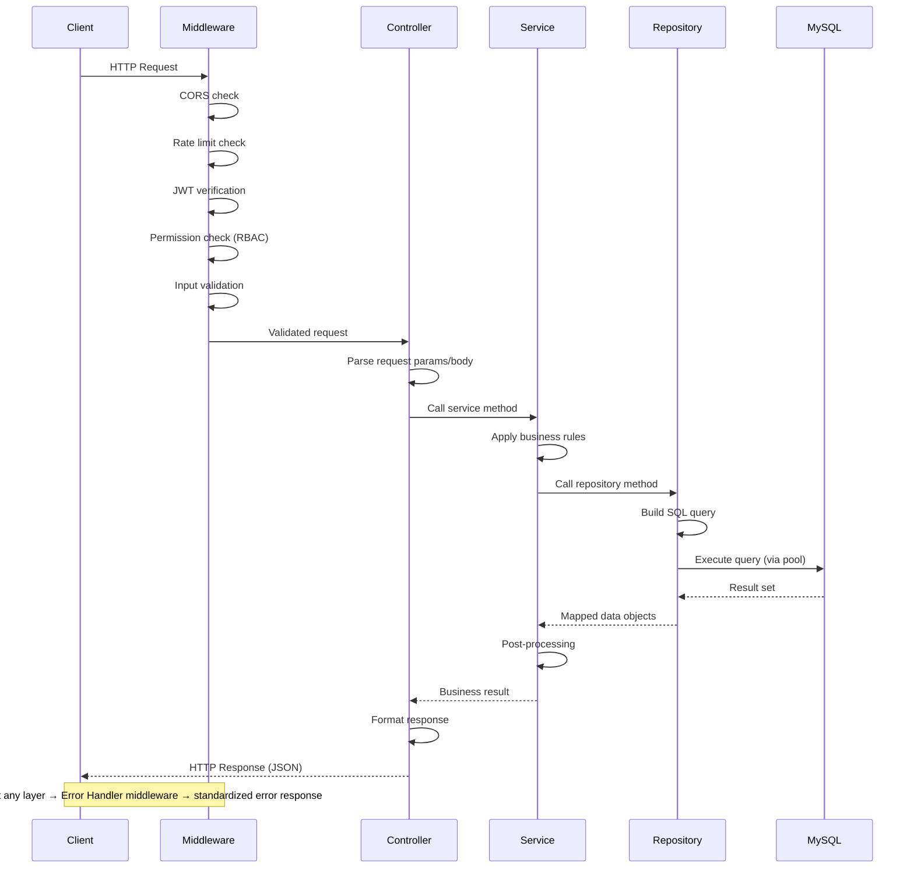
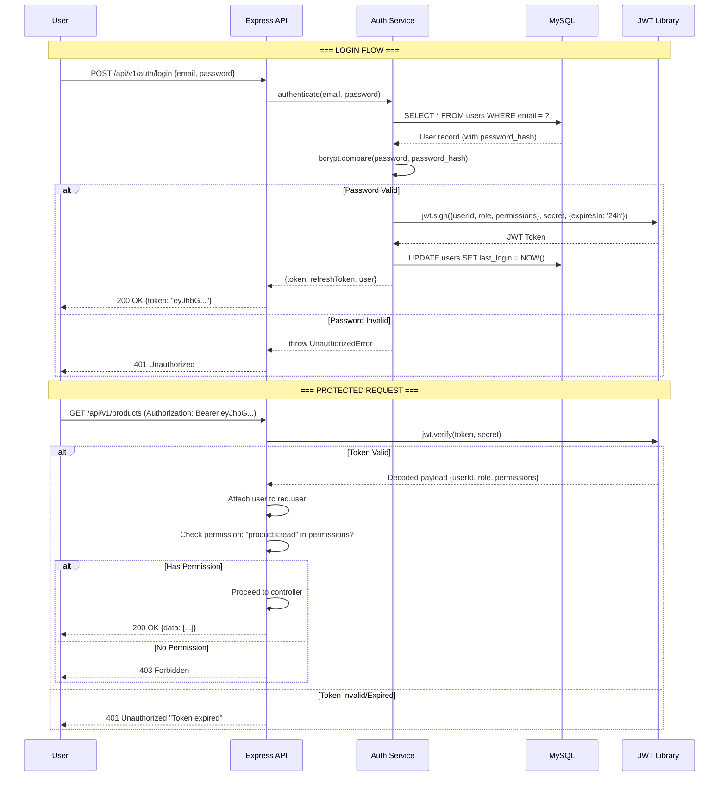
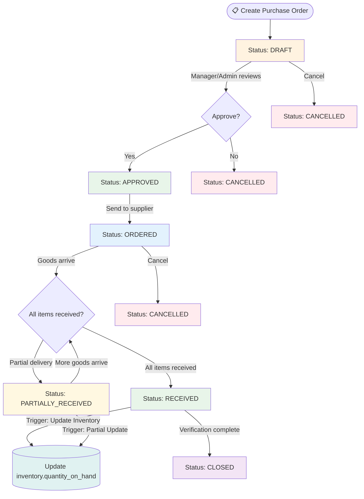
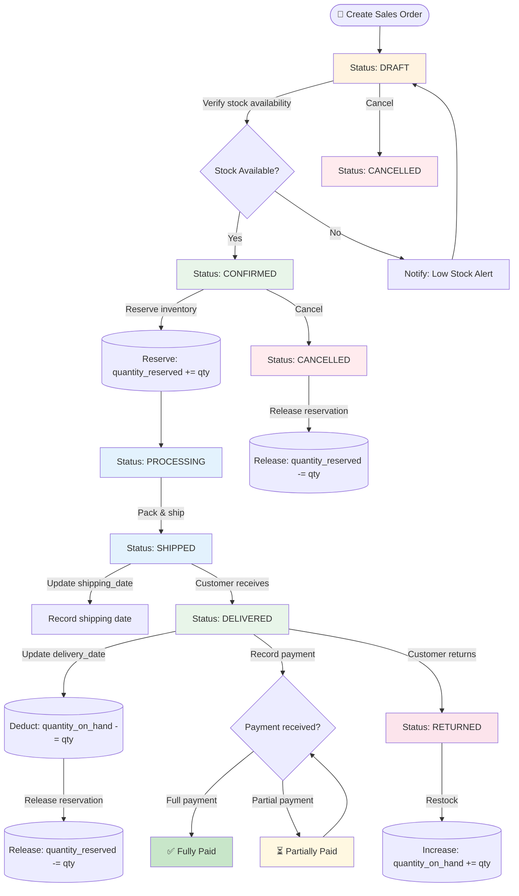
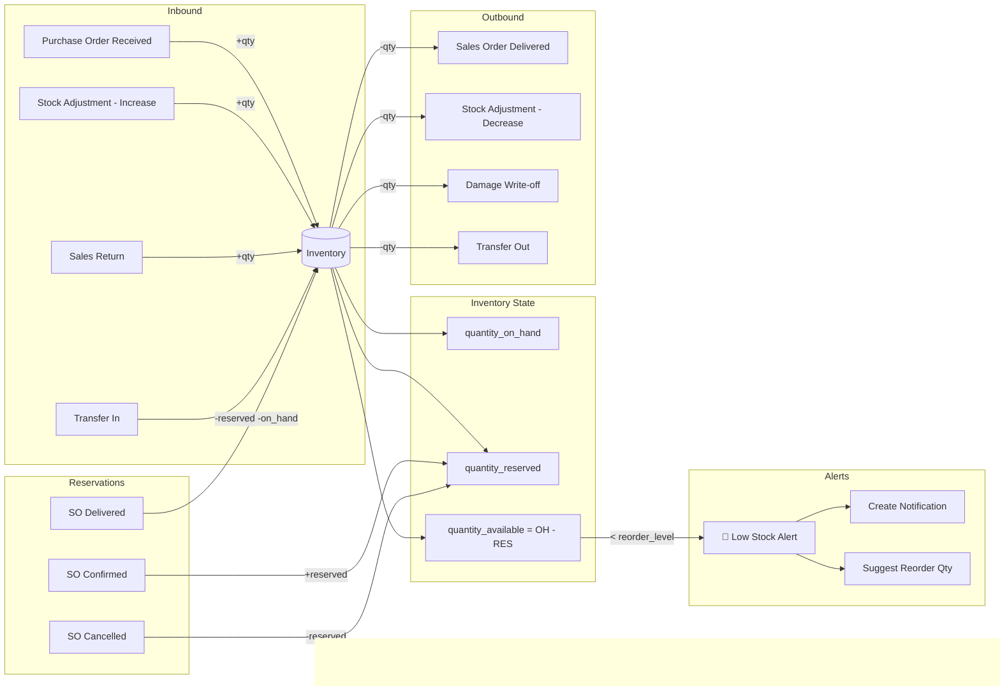
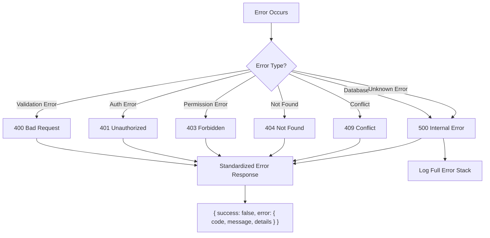

# 📐 System Architecture Document

## Smart Retail Inventory Management System

---

## Table of Contents

- [Architecture Overview](#architecture-overview)
- [Layered Architecture](#layered-architecture)
- [Data Flow](#data-flow)
- [Authentication & Authorization Flow](#authentication--authorization-flow)
- [Purchase Order Workflow](#purchase-order-workflow)
- [Sales Order Workflow](#sales-order-workflow)
- [Inventory Management Flow](#inventory-management-flow)
- [Error Handling Strategy](#error-handling-strategy)
- [Security Measures](#security-measures)
- [Design Patterns](#design-patterns)
- [Technology Justification](#technology-justification)

---

## Architecture Overview

The Smart Retail Inventory Management System follows a **monolithic layered architecture** with clear separation of concerns. Each layer has a specific responsibility and communicates only with its immediate neighbor, promoting maintainability, testability, and scalability.

### Key Architectural Principles

1. **Separation of Concerns** — Each layer handles one responsibility (routing, business logic, data access)
2. **Single Responsibility** — Each module/file has one reason to change
3. **Dependency Inversion** — Upper layers depend on abstractions, not concrete implementations
4. **Fail-Fast** — Validate early, reject invalid requests at the middleware level
5. **Defense in Depth** — Multiple security layers (authentication, authorization, validation, sanitization)

### High-Level Component Diagram

```
┌────────────────────────────────────────────────────────────────┐
│                        CLIENT LAYER                            │
│  ┌──────────────┐  ┌──────────────┐  ┌──────────────────────┐  │
│  │  Web Browser  │  │   Postman    │  │  Third-Party Client  │  │
│  └──────┬───────┘  └──────┬───────┘  └──────────┬───────────┘  │
└─────────┼─────────────────┼─────────────────────┼──────────────┘
          │                 │                     │
          └────────────────┐│┌────────────────────┘
                           │││
                    HTTP / REST API
                           │││
┌──────────────────────────┼┼┼───────────────────────────────────┐
│                     SERVER LAYER (Node.js + Express.js)         │
│                          │││                                    │
│  ┌───────────────────────┼┼┼────────────────────────────────┐  │
│  │              MIDDLEWARE PIPELINE                          │  │
│  │  CORS → Rate Limit → Auth → RBAC → Validation → Handler │  │
│  └───────────────────────┼┼┼────────────────────────────────┘  │
│                          │││                                    │
│  ┌───────────────────────┼┼┼────────────────────────────────┐  │
│  │              CONTROLLER LAYER                            │  │
│  │  Parse Request → Call Service → Format Response          │  │
│  └───────────────────────┼┼┼────────────────────────────────┘  │
│                          │││                                    │
│  ┌───────────────────────┼┼┼────────────────────────────────┐  │
│  │              SERVICE LAYER                               │  │
│  │  Business Rules → Validation → Orchestration             │  │
│  └───────────────────────┼┼┼────────────────────────────────┘  │
│                          │││                                    │
│  ┌───────────────────────┼┼┼────────────────────────────────┐  │
│  │              REPOSITORY / MODEL LAYER                    │  │
│  │  SQL Queries → Connection Pool → Result Mapping          │  │
│  └───────────────────────┼┼┼────────────────────────────────┘  │
│                          │││                                    │
└──────────────────────────┼┼┼───────────────────────────────────┘
                           │││
                    MySQL Protocol
                           │││
┌──────────────────────────┼┼┼───────────────────────────────────┐
│                     DATABASE LAYER (MySQL 8+)                   │
│                          │││                                    │
│  ┌──────────┐ ┌──────────┼┼┼──────┐ ┌─────────────────────┐   │
│  │  Tables   │ │  Indexes │││      │ │  Triggers &          │   │
│  │  (20)     │ │  (B-Tree,│││      │ │  Stored Procedures   │   │
│  │           │ │  Composite│)      │ │  (5 + 6)             │   │
│  └──────────┘ └───────────────────┘ └─────────────────────┘   │
└────────────────────────────────────────────────────────────────┘
```

---

## Layered Architecture



### Layer Responsibilities

| Layer                | Responsibility                                                              | Example                              |
| -------------------- | --------------------------------------------------------------------------- | ------------------------------------ |
| **Middleware**       | Cross-cutting concerns: auth, validation, rate limiting, error handling     | JWT verification, input sanitization |
| **Controller**       | HTTP request/response handling. Parse params, call service, format response | Extract body, return 201 with JSON   |
| **Service**          | Business logic, workflow orchestration, cross-entity coordination           | PO approval rules, stock reservation |
| **Repository/Model** | Data access, SQL query execution, result mapping                            | `SELECT * FROM products WHERE ...`   |
| **Database**         | Data storage, referential integrity, triggers, stored procedures            | Tables, indexes, constraints         |

---

## Data Flow

### Request Lifecycle: Controller → Service → Repository → Database



### Example: GET /api/v1/products/:id

```
1. [Middleware]    → Verify JWT token, check "products:read" permission
2. [Controller]   → Extract `id` from req.params, call productService.getById(id)
3. [Service]      → Validate ID exists, call productModel.findById(id)
4. [Model/Repo]   → Execute: SELECT p.*, c.category_name, b.brand_name
                     FROM products p
                     JOIN categories c ON p.category_id = c.category_id
                     LEFT JOIN brands b ON p.brand_id = b.brand_id
                     WHERE p.product_id = ? AND p.is_deleted = FALSE
5. [Model/Repo]   → Return product object
6. [Service]      → Return product (or throw NotFoundError)
7. [Controller]   → Return { success: true, data: product }
```

---

## Authentication & Authorization Flow

### JWT Authentication Flow



### Authorization Matrix

| Role        | Products | Inventory | Purchase Orders | Sales Orders | Reports | Users | Audit Logs |
| ----------- | -------- | --------- | --------------- | ------------ | ------- | ----- | ---------- |
| **Admin**   | CRUD     | CRUD      | CRUD + Approve  | CRUD         | Full    | CRUD  | View       |
| **Manager** | CRUD     | CRU       | CRU + Approve   | CRUD         | Full    | View  | View       |
| **Staff**   | CR       | CRU       | CR              | CR           | Limited | —     | —          |
| **Viewer**  | R        | R         | R               | R            | View    | —     | —          |

---

## Purchase Order Workflow



### Purchase Order State Transitions

| From State           | To State             | Action                | Triggered By  | Side Effects                 |
| -------------------- | -------------------- | --------------------- | ------------- | ---------------------------- |
| —                    | `draft`              | Create PO             | Staff/Manager | Generate PO number           |
| `draft`              | `approved`           | Approve PO            | Manager/Admin | Send notification to creator |
| `draft`              | `cancelled`          | Cancel PO             | Creator/Admin | —                            |
| `approved`           | `ordered`            | Place with supplier   | Manager       | Update order_date            |
| `ordered`            | `partially_received` | Receive partial goods | Staff         | Update inventory (partial)   |
| `ordered`            | `received`           | Receive all goods     | Staff         | Update inventory (full)      |
| `partially_received` | `received`           | Receive remaining     | Staff         | Update inventory             |
| `ordered`            | `cancelled`          | Cancel order          | Admin         | —                            |
| `received`           | `closed`             | Close PO              | Manager/Admin | Final verification           |

---

## Sales Order Workflow



### Sales Order State Transitions

| From State          | To State     | Action            | Side Effects                           |
| ------------------- | ------------ | ----------------- | -------------------------------------- |
| —                   | `draft`      | Create SO         | Generate SO number, validate customer  |
| `draft`             | `confirmed`  | Confirm order     | Check stock, reserve inventory         |
| `confirmed`         | `processing` | Begin fulfillment | Pick & pack notification               |
| `processing`        | `shipped`    | Ship order        | Record shipping date                   |
| `shipped`           | `delivered`  | Mark delivered    | Deduct inventory, record delivery date |
| `draft`/`confirmed` | `cancelled`  | Cancel order      | Release reserved inventory             |
| `delivered`         | `returned`   | Process return    | Restock inventory, process refund      |

---

## Inventory Management Flow



### Inventory Quantity Rules

| Event                        | quantity_on_hand | quantity_reserved | quantity_available |
| ---------------------------- | :--------------: | :---------------: | :----------------: |
| PO goods received            |  +received_qty   |         —         |   +received_qty    |
| SO confirmed                 |        —         |   +ordered_qty    |    -ordered_qty    |
| SO delivered                 |   -ordered_qty   |   -ordered_qty    |         —          |
| SO cancelled                 |        —         |   -ordered_qty    |    +ordered_qty    |
| Manual adjustment (increase) |     +adj_qty     |         —         |      +adj_qty      |
| Manual adjustment (decrease) |     -adj_qty     |         —         |      -adj_qty      |
| Transfer out                 |  -transfer_qty   |         —         |   -transfer_qty    |
| Transfer in                  |  +transfer_qty   |         —         |   +transfer_qty    |
| Sales return                 |   +return_qty    |         —         |    +return_qty     |

---

## Error Handling Strategy

### Error Classification



### Custom Error Classes

```javascript
// utils/errors.js
class AppError extends Error {
  constructor(message, statusCode, errorCode) {
    super(message);
    this.statusCode = statusCode;
    this.errorCode = errorCode;
    this.isOperational = true;
  }
}

class NotFoundError extends AppError {
  constructor(resource = 'Resource') {
    super(`${resource} not found`, 404, 'NOT_FOUND');
  }
}

class ValidationError extends AppError {
  constructor(message, details = []) {
    super(message, 400, 'VALIDATION_ERROR');
    this.details = details;
  }
}

class UnauthorizedError extends AppError {
  constructor(message = 'Authentication required') {
    super(message, 401, 'UNAUTHORIZED');
  }
}

class ForbiddenError extends AppError {
  constructor(message = 'Insufficient permissions') {
    super(message, 403, 'FORBIDDEN');
  }
}

class ConflictError extends AppError {
  constructor(message = 'Resource already exists') {
    super(message, 409, 'CONFLICT');
  }
}
```

### Global Error Handler Middleware

```javascript
// middleware/errorHandler.js
const errorHandler = (err, req, res, next) => {
  // Log error
  logger.error({
    message: err.message,
    stack: err.stack,
    url: req.originalUrl,
    method: req.method,
    userId: req.user?.userId
  });

  // Operational errors (expected)
  if (err.isOperational) {
    return res.status(err.statusCode).json({
      success: false,
      error: {
        code: err.errorCode,
        message: err.message,
        details: err.details || undefined
      }
    });
  }

  // MySQL duplicate entry error
  if (err.code === 'ER_DUP_ENTRY') {
    return res.status(409).json({
      success: false,
      error: {
        code: 'DUPLICATE_ENTRY',
        message: 'A record with this value already exists'
      }
    });
  }

  // Unknown errors (bugs)
  return res.status(500).json({
    success: false,
    error: {
      code: 'INTERNAL_ERROR',
      message: 'An unexpected error occurred'
    }
  });
};
```

---

## Security Measures

### 1. Authentication Security

| Measure                    | Implementation                    | Purpose                            |
| -------------------------- | --------------------------------- | ---------------------------------- |
| **Password Hashing**       | bcrypt with 12 salt rounds        | Prevent plaintext password storage |
| **JWT Tokens**             | RS256/HS256, 24h expiry           | Stateless authentication           |
| **Token Refresh**          | Separate refresh token, 7d expiry | Seamless session extension         |
| **Brute Force Protection** | Rate limiting on /auth/login      | Prevent credential stuffing        |

### 2. Authorization Security

| Measure                  | Implementation               | Purpose                      |
| ------------------------ | ---------------------------- | ---------------------------- |
| **RBAC**                 | Role-based permission checks | Principle of least privilege |
| **Granular Permissions** | Module:action format         | Fine-grained access control  |
| **Middleware Chain**     | Auth → RBAC → Controller     | Defense in depth             |

### 3. Input Security

| Measure                   | Implementation                  | Purpose                      |
| ------------------------- | ------------------------------- | ---------------------------- |
| **Validation**            | express-validator on all inputs | Reject malformed data        |
| **Parameterized Queries** | `mysql2` prepared statements    | Prevent SQL injection        |
| **Input Sanitization**    | Trim, escape, normalize         | Prevent XSS                  |
| **Content-Type Check**    | Accept only `application/json`  | Prevent content-type attacks |

### 4. Transport & Infrastructure Security

| Measure           | Implementation                        | Purpose                                    |
| ----------------- | ------------------------------------- | ------------------------------------------ |
| **CORS**          | Whitelist allowed origins             | Prevent unauthorized cross-origin requests |
| **Rate Limiting** | express-rate-limit (100 req/15min)    | Prevent DoS attacks                        |
| **Helmet**        | HTTP security headers                 | Prevent common web vulnerabilities         |
| **Error Masking** | Generic error messages in production  | Prevent information disclosure             |
| **Audit Logging** | All mutations logged with user ID, IP | Accountability and forensics               |

### 5. Database Security

| Measure                | Implementation                      | Purpose                  |
| ---------------------- | ----------------------------------- | ------------------------ |
| **Connection Pooling** | mysql2 pool (max 10 connections)    | Resource management      |
| **Least Privilege**    | App DB user has limited permissions | Minimize blast radius    |
| **Soft Deletes**       | `is_deleted` flag, no hard deletes  | Data preservation        |
| **FK Constraints**     | RESTRICT on delete                  | Prevent orphaned records |

---

## Design Patterns

### 1. Repository Pattern

**What:** Abstracts data access logic behind a clean interface, separating SQL queries from business logic.

**Why:** Enables swapping the database engine without changing service layer code. Makes unit testing possible by mocking the repository.

```javascript
// models/productModel.js (Repository)
class ProductModel {
  async findById(id) {
    const [rows] = await pool.execute(
      `SELECT p.*, c.category_name, b.brand_name 
             FROM products p
             JOIN categories c ON p.category_id = c.category_id
             LEFT JOIN brands b ON p.brand_id = b.brand_id
             WHERE p.product_id = ? AND p.is_deleted = FALSE`,
      [id]
    );
    return rows[0] || null;
  }

  async findAll(filters, pagination) {
    /* ... */
  }
  async create(data) {
    /* ... */
  }
  async update(id, data) {
    /* ... */
  }
  async softDelete(id) {
    /* ... */
  }
}
```

### 2. Service Layer Pattern

**What:** Encapsulates business logic in dedicated service classes that orchestrate between controllers and repositories.

**Why:** Controllers stay thin (HTTP-only concerns). Business rules are centralized and reusable. Services can coordinate across multiple repositories.

```javascript
// services/purchaseOrderService.js
class PurchaseOrderService {
  async approvePurchaseOrder(poId, approvedBy) {
    // 1. Fetch PO
    const po = await purchaseOrderModel.findById(poId);
    if (!po) throw new NotFoundError('Purchase Order');

    // 2. Validate state transition
    if (po.status !== 'draft') {
      throw new ValidationError('Only draft POs can be approved');
    }

    // 3. Update status
    await purchaseOrderModel.updateStatus(poId, 'approved', { approved_by: approvedBy });

    // 4. Create notification for PO creator
    await notificationService.create({
      user_id: po.created_by,
      title: 'Purchase Order Approved',
      message: `PO ${po.po_number} has been approved`,
      type: 'success',
      reference_type: 'purchase_order',
      reference_id: poId
    });

    // 5. Log audit trail
    await auditService.log({
      user_id: approvedBy,
      action: 'UPDATE',
      table_name: 'purchase_orders',
      record_id: poId,
      old_values: { status: 'draft' },
      new_values: { status: 'approved', approved_by: approvedBy }
    });

    return await purchaseOrderModel.findById(poId);
  }
}
```

### 3. Middleware Chain Pattern

**What:** A pipeline of functions that process HTTP requests sequentially, each performing a specific cross-cutting concern.

**Why:** Separates authentication, authorization, validation, and error handling from business logic. Middleware is composable and reusable across routes.

```javascript
// routes/productRoutes.js
router.post(
  '/',
  authenticate, // 1. Verify JWT
  authorize('products:create'), // 2. Check permission
  validateProduct, // 3. Validate request body
  productController.create // 4. Handle request
);

// middleware/auth.js
const authenticate = async (req, res, next) => {
  try {
    const token = req.headers.authorization?.split(' ')[1];
    if (!token) throw new UnauthorizedError('No token provided');

    const decoded = jwt.verify(token, process.env.JWT_SECRET);
    req.user = decoded;
    next();
  } catch (error) {
    next(new UnauthorizedError('Invalid or expired token'));
  }
};

// middleware/rbac.js
const authorize = (...requiredPermissions) => {
  return (req, res, next) => {
    const userPermissions = req.user.permissions || [];
    const hasPermission = requiredPermissions.every((perm) => userPermissions.includes(perm));

    if (!hasPermission) {
      return next(new ForbiddenError());
    }
    next();
  };
};
```

### 4. Factory Pattern

**What:** Creates objects without specifying exact classes, using a factory method to determine the type.

**Why:** Used for creating standardized API responses, error objects, and notification objects with consistent structure.

```javascript
// utils/responseFactory.js
class ResponseFactory {
  static success(data, message = 'Success', statusCode = 200) {
    return {
      success: true,
      message,
      data,
      timestamp: new Date().toISOString()
    };
  }

  static paginated(data, pagination) {
    return {
      success: true,
      data,
      pagination: {
        page: pagination.page,
        limit: pagination.limit,
        totalRecords: pagination.totalRecords,
        totalPages: Math.ceil(pagination.totalRecords / pagination.limit)
      },
      timestamp: new Date().toISOString()
    };
  }

  static error(message, errorCode, details = null) {
    return {
      success: false,
      error: {
        code: errorCode,
        message,
        details
      },
      timestamp: new Date().toISOString()
    };
  }
}
```

### 5. Singleton Pattern (Connection Pool)

**What:** Ensures only one instance of the database connection pool exists throughout the application lifecycle.

**Why:** Connection pools are expensive to create. Sharing a single pool across all modules ensures efficient resource utilization.

```javascript
// config/database.js
const mysql = require('mysql2/promise');

const pool = mysql.createPool({
  host: process.env.DB_HOST,
  user: process.env.DB_USER,
  password: process.env.DB_PASSWORD,
  database: process.env.DB_NAME,
  port: process.env.DB_PORT || 3306,
  connectionLimit: parseInt(process.env.DB_CONNECTION_LIMIT) || 10,
  waitForConnections: true,
  queueLimit: 0,
  enableKeepAlive: true,
  keepAliveInitialDelay: 0
});

// Export single pool instance (Singleton)
module.exports = pool;
```

---

## Technology Justification

| Technology             | Why Chosen                                                                                                                                                                                        | Alternatives Considered                                                                                                                                           |
| ---------------------- | ------------------------------------------------------------------------------------------------------------------------------------------------------------------------------------------------- | ----------------------------------------------------------------------------------------------------------------------------------------------------------------- |
| **Node.js**            | Non-blocking I/O ideal for I/O-bound inventory operations. Same language (JS) for frontend and backend. Large ecosystem via npm.                                                                  | Python/Django (slower I/O), Java/Spring (heavier setup)                                                                                                           |
| **Express.js**         | Minimal, un-opinionated framework with excellent middleware support. Industry standard with huge community. Easy to learn and extend.                                                             | Fastify (newer, less docs), Koa (smaller community), NestJS (more complex for this scale)                                                                         |
| **MySQL 8+**           | ACID-compliant relational database perfect for transactional inventory operations. Strong support for complex JOINs, stored procedures, triggers, and window functions. Free and widely deployed. | PostgreSQL (slightly better for complex queries but MySQL has wider hosting support), MongoDB (poor fit for relational inventory data with complex relationships) |
| **JWT**                | Stateless authentication eliminates server-side session storage. Easy to scale horizontally. Tokens carry user permissions, reducing DB lookups per request.                                      | Session-based auth (requires session store, harder to scale), OAuth2 (overkill for internal system)                                                               |
| **bcrypt**             | Industry-standard password hashing with adaptive cost factor. Resistant to rainbow table and brute-force attacks. Well-audited library.                                                           | Argon2 (newer, excellent but less widely supported in hosting), scrypt (good alternative)                                                                         |
| **mysql2**             | Native MySQL driver with Promise support, connection pooling, and prepared statement support. Faster than mysql package.                                                                          | Sequelize ORM (adds abstraction overhead, less control over queries), Knex.js (query builder, good but unnecessary abstraction)                                   |
| **Vanilla JavaScript** | Zero build step, no framework lock-in. Ideal for learning and demonstrating core web skills. Lightweight and fast.                                                                                | React (heavier for this scope), Vue (additional complexity), jQuery (outdated)                                                                                    |
| **express-validator**  | Declarative validation chains with built-in sanitizers. Integrates seamlessly with Express middleware pattern.                                                                                    | Joi (popular but separate middleware setup), Yup (typically used with React forms), class-validator (TypeScript-oriented)                                         |
| **winston**            | Structured logging with multiple transports (console, file, external services). Log levels, formatting, and metadata support.                                                                     | Pino (faster but less featured), Bunyan (good but less actively maintained), console.log (insufficient for production)                                            |
