# 🗄️ Database Design Document

## Smart Retail Inventory Management System

---

## Table of Contents

- [Overview](#overview)
- [ER Diagram](#er-diagram)
- [Table Definitions](#table-definitions)
- [Normalization Analysis](#normalization-analysis)
- [Denormalization Decisions](#denormalization-decisions)
- [Data Integrity Constraints Summary](#data-integrity-constraints-summary)
- [Interview Talking Points](#interview-talking-points)

---

## Overview

The Smart Retail Inventory Management System uses a **20-table relational schema** designed in **Third Normal Form (3NF)**. The schema supports the complete lifecycle of retail inventory management — from procurement through sales, including user management, audit logging, and analytics.

### Schema Summary

| #   | Table                  | Purpose                                | Relationships                   |
| --- | ---------------------- | -------------------------------------- | ------------------------------- |
| 1   | `users`                | System users and credentials           | → roles                         |
| 2   | `roles`                | User role definitions                  | → role_permissions              |
| 3   | `permissions`          | Granular permission definitions        | → role_permissions              |
| 4   | `role_permissions`     | Role-permission mapping (junction)     | → roles, permissions            |
| 5   | `categories`           | Product category hierarchy             | → products                      |
| 6   | `brands`               | Product brand information              | → products                      |
| 7   | `suppliers`            | Supplier/vendor information            | → products, purchase_orders     |
| 8   | `customers`            | Customer information                   | → sales_orders                  |
| 9   | `products`             | Product catalog                        | → categories, brands, suppliers |
| 10  | `warehouses`           | Warehouse/storage locations            | → inventory                     |
| 11  | `inventory`            | Stock levels per product per warehouse | → products, warehouses          |
| 12  | `purchase_orders`      | Purchase order headers                 | → suppliers, users              |
| 13  | `purchase_order_items` | Purchase order line items              | → purchase_orders, products     |
| 14  | `sales_orders`         | Sales order headers                    | → customers, users              |
| 15  | `sales_order_items`    | Sales order line items                 | → sales_orders, products        |
| 16  | `payments`             | Payment records for sales orders       | → sales_orders                  |
| 17  | `stock_adjustments`    | Manual stock adjustment records        | → products, warehouses, users   |
| 18  | `notifications`        | System notification messages           | → users                         |
| 19  | `audit_logs`           | Data change audit trail                | → users                         |
| 20  | `stock_transfers`      | Inter-warehouse stock transfers        | → products, warehouses, users   |

---

## ER Diagram

```mermaid
erDiagram
    ROLES ||--o{ ROLE_PERMISSIONS : "has"
    PERMISSIONS ||--o{ ROLE_PERMISSIONS : "assigned_to"
    ROLES ||--o{ USERS : "assigned_to"

    USERS ||--o{ PURCHASE_ORDERS : "creates"
    USERS ||--o{ SALES_ORDERS : "creates"
    USERS ||--o{ AUDIT_LOGS : "performs"
    USERS ||--o{ NOTIFICATIONS : "receives"
    USERS ||--o{ STOCK_ADJUSTMENTS : "performs"
    USERS ||--o{ STOCK_TRANSFERS : "initiates"

    CATEGORIES ||--o{ PRODUCTS : "contains"
    BRANDS ||--o{ PRODUCTS : "manufactures"
    SUPPLIERS ||--o{ PRODUCTS : "supplies"
    SUPPLIERS ||--o{ PURCHASE_ORDERS : "fulfills"

    PRODUCTS ||--o{ INVENTORY : "stored_in"
    PRODUCTS ||--o{ PURCHASE_ORDER_ITEMS : "ordered_in"
    PRODUCTS ||--o{ SALES_ORDER_ITEMS : "sold_in"
    PRODUCTS ||--o{ STOCK_ADJUSTMENTS : "adjusted"
    PRODUCTS ||--o{ STOCK_TRANSFERS : "transferred"

    WAREHOUSES ||--o{ INVENTORY : "holds"
    WAREHOUSES ||--o{ STOCK_ADJUSTMENTS : "location"
    WAREHOUSES ||--o{ STOCK_TRANSFERS : "from_or_to"

    PURCHASE_ORDERS ||--o{ PURCHASE_ORDER_ITEMS : "contains"

    CUSTOMERS ||--o{ SALES_ORDERS : "places"
    SALES_ORDERS ||--o{ SALES_ORDER_ITEMS : "contains"
    SALES_ORDERS ||--o{ PAYMENTS : "paid_via"

    ROLES {
        int role_id PK
        varchar role_name UK
        text description
        datetime created_at
        datetime updated_at
    }

    PERMISSIONS {
        int permission_id PK
        varchar permission_name UK
        varchar module
        varchar action
        datetime created_at
    }

    ROLE_PERMISSIONS {
        int role_id FK
        int permission_id FK
    }

    USERS {
        int user_id PK
        varchar first_name
        varchar last_name
        varchar email UK
        varchar password_hash
        int role_id FK
        enum status
        datetime last_login
        datetime created_at
        datetime updated_at
        boolean is_deleted
    }

    CATEGORIES {
        int category_id PK
        varchar category_name UK
        text description
        int parent_category_id FK
        boolean is_active
        datetime created_at
        datetime updated_at
    }

    BRANDS {
        int brand_id PK
        varchar brand_name UK
        text description
        varchar logo_url
        boolean is_active
        datetime created_at
        datetime updated_at
    }

    SUPPLIERS {
        int supplier_id PK
        varchar company_name
        varchar contact_name
        varchar email UK
        varchar phone
        text address
        varchar city
        varchar state
        varchar zip_code
        varchar country
        enum status
        decimal rating
        datetime created_at
        datetime updated_at
        boolean is_deleted
    }

    CUSTOMERS {
        int customer_id PK
        varchar first_name
        varchar last_name
        varchar email UK
        varchar phone
        text address
        varchar city
        varchar state
        varchar zip_code
        varchar country
        enum customer_type
        datetime created_at
        datetime updated_at
        boolean is_deleted
    }

    PRODUCTS {
        int product_id PK
        varchar sku UK
        varchar product_name
        text description
        int category_id FK
        int brand_id FK
        int supplier_id FK
        decimal unit_price
        decimal cost_price
        int reorder_level
        int reorder_quantity
        varchar unit_of_measure
        decimal weight
        varchar image_url
        enum status
        datetime created_at
        datetime updated_at
        boolean is_deleted
    }

    WAREHOUSES {
        int warehouse_id PK
        varchar warehouse_name UK
        varchar warehouse_code UK
        text address
        varchar city
        varchar state
        varchar zip_code
        varchar country
        varchar manager_name
        varchar phone
        int capacity
        boolean is_active
        datetime created_at
        datetime updated_at
    }

    INVENTORY {
        int inventory_id PK
        int product_id FK
        int warehouse_id FK
        int quantity_on_hand
        int quantity_reserved
        int quantity_available
        int minimum_stock
        int maximum_stock
        datetime last_restock_date
        datetime created_at
        datetime updated_at
    }

    PURCHASE_ORDERS {
        int po_id PK
        varchar po_number UK
        int supplier_id FK
        int created_by FK
        int approved_by FK
        enum status
        date order_date
        date expected_delivery_date
        date actual_delivery_date
        decimal subtotal
        decimal tax_amount
        decimal shipping_cost
        decimal total_amount
        text notes
        datetime created_at
        datetime updated_at
    }

    PURCHASE_ORDER_ITEMS {
        int po_item_id PK
        int po_id FK
        int product_id FK
        int quantity_ordered
        int quantity_received
        decimal unit_price
        decimal discount_percent
        decimal line_total
        datetime created_at
    }

    SALES_ORDERS {
        int so_id PK
        varchar so_number UK
        int customer_id FK
        int created_by FK
        enum status
        date order_date
        date shipping_date
        date delivery_date
        decimal subtotal
        decimal tax_amount
        decimal discount_amount
        decimal total_amount
        decimal amount_paid
        varchar shipping_address
        text notes
        datetime created_at
        datetime updated_at
    }

    SALES_ORDER_ITEMS {
        int so_item_id PK
        int so_id FK
        int product_id FK
        int quantity
        decimal unit_price
        decimal discount_percent
        decimal line_total
        datetime created_at
    }

    PAYMENTS {
        int payment_id PK
        int so_id FK
        decimal amount
        enum payment_method
        varchar transaction_reference
        enum payment_status
        date payment_date
        text notes
        datetime created_at
        datetime updated_at
    }

    STOCK_ADJUSTMENTS {
        int adjustment_id PK
        int product_id FK
        int warehouse_id FK
        int adjusted_by FK
        enum adjustment_type
        int quantity_change
        int quantity_before
        int quantity_after
        varchar reason
        text notes
        datetime created_at
    }

    NOTIFICATIONS {
        int notification_id PK
        int user_id FK
        varchar title
        text message
        enum type
        boolean is_read
        varchar reference_type
        int reference_id
        datetime created_at
    }

    AUDIT_LOGS {
        int log_id PK
        int user_id FK
        varchar action
        varchar table_name
        int record_id
        json old_values
        json new_values
        varchar ip_address
        datetime created_at
    }

    STOCK_TRANSFERS {
        int transfer_id PK
        int product_id FK
        int from_warehouse_id FK
        int to_warehouse_id FK
        int initiated_by FK
        int quantity
        enum status
        text notes
        datetime created_at
        datetime completed_at
    }
```

---

## Table Definitions

### 1. `roles`

**Business Purpose:** Defines the access roles available in the system. Each role represents a level of authority (e.g., Admin, Manager, Staff, Viewer) and determines what permissions a user has. This table is central to the RBAC (Role-Based Access Control) system.

| Column        | Type        | Constraints                 | Description                                  |
| ------------- | ----------- | --------------------------- | -------------------------------------------- |
| `role_id`     | INT         | PK, AUTO_INCREMENT          | Unique role identifier                       |
| `role_name`   | VARCHAR(50) | NOT NULL, UNIQUE            | Role display name (e.g., "Admin", "Manager") |
| `description` | TEXT        | NULLABLE                    | Human-readable role description              |
| `created_at`  | DATETIME    | DEFAULT CURRENT_TIMESTAMP   | Record creation timestamp                    |
| `updated_at`  | DATETIME    | ON UPDATE CURRENT_TIMESTAMP | Last modification timestamp                  |

**Relationships:**

- `roles.role_id` → **Referenced by** `users.role_id` (one-to-many: one role can be assigned to many users)
- `roles.role_id` → **Referenced by** `role_permissions.role_id` (one-to-many: one role has many permissions)

---

### 2. `permissions`

**Business Purpose:** Stores granular permission definitions that can be assigned to roles. Each permission represents a specific action on a specific module (e.g., "products:create", "reports:view"). This enables fine-grained access control beyond simple role checks.

| Column            | Type         | Constraints               | Description                                              |
| ----------------- | ------------ | ------------------------- | -------------------------------------------------------- |
| `permission_id`   | INT          | PK, AUTO_INCREMENT        | Unique permission identifier                             |
| `permission_name` | VARCHAR(100) | NOT NULL, UNIQUE          | Permission key (e.g., "products:create")                 |
| `module`          | VARCHAR(50)  | NOT NULL                  | Module this permission belongs to (e.g., "products")     |
| `action`          | VARCHAR(50)  | NOT NULL                  | Action type (e.g., "create", "read", "update", "delete") |
| `created_at`      | DATETIME     | DEFAULT CURRENT_TIMESTAMP | Record creation timestamp                                |

**Relationships:**

- `permissions.permission_id` → **Referenced by** `role_permissions.permission_id` (one-to-many)

---

### 3. `role_permissions`

**Business Purpose:** Junction table that creates a many-to-many relationship between roles and permissions. This design allows flexible permission assignment — any combination of permissions can be assigned to any role without data redundancy.

| Column          | Type | Constraints        | Description                            |
| --------------- | ---- | ------------------ | -------------------------------------- |
| `role_id`       | INT  | PK (composite), FK | References `roles.role_id`             |
| `permission_id` | INT  | PK (composite), FK | References `permissions.permission_id` |

**Relationships:**

- `role_permissions.role_id` → `roles.role_id` (FK, CASCADE DELETE)
- `role_permissions.permission_id` → `permissions.permission_id` (FK, CASCADE DELETE)

---

### 4. `users`

**Business Purpose:** Stores all system user accounts including authentication credentials (hashed passwords), profile information, and role assignments. Supports soft-delete to maintain referential integrity with historical records like audit logs and orders.

| Column          | Type                                  | Constraints                 | Description                        |
| --------------- | ------------------------------------- | --------------------------- | ---------------------------------- |
| `user_id`       | INT                                   | PK, AUTO_INCREMENT          | Unique user identifier             |
| `first_name`    | VARCHAR(50)                           | NOT NULL                    | User's first name                  |
| `last_name`     | VARCHAR(50)                           | NOT NULL                    | User's last name                   |
| `email`         | VARCHAR(100)                          | NOT NULL, UNIQUE            | Login email (used as username)     |
| `password_hash` | VARCHAR(255)                          | NOT NULL                    | bcrypt-hashed password             |
| `role_id`       | INT                                   | FK, NOT NULL                | User's assigned role               |
| `status`        | ENUM('active','inactive','suspended') | DEFAULT 'active'            | Account status                     |
| `last_login`    | DATETIME                              | NULLABLE                    | Timestamp of last successful login |
| `created_at`    | DATETIME                              | DEFAULT CURRENT_TIMESTAMP   | Account creation date              |
| `updated_at`    | DATETIME                              | ON UPDATE CURRENT_TIMESTAMP | Last profile update                |
| `is_deleted`    | BOOLEAN                               | DEFAULT FALSE               | Soft-delete flag                   |

**Relationships:**

- `users.role_id` → `roles.role_id` (FK: each user has exactly one role)
- `users.user_id` → **Referenced by** `purchase_orders.created_by`, `purchase_orders.approved_by`
- `users.user_id` → **Referenced by** `sales_orders.created_by`
- `users.user_id` → **Referenced by** `audit_logs.user_id`
- `users.user_id` → **Referenced by** `notifications.user_id`
- `users.user_id` → **Referenced by** `stock_adjustments.adjusted_by`
- `users.user_id` → **Referenced by** `stock_transfers.initiated_by`

---

### 5. `categories`

**Business Purpose:** Organizes products into hierarchical categories (e.g., Electronics → Laptops → Gaming Laptops). The self-referencing `parent_category_id` enables unlimited nesting depth, supporting complex product taxonomies common in retail systems.

| Column               | Type         | Constraints                 | Description                   |
| -------------------- | ------------ | --------------------------- | ----------------------------- |
| `category_id`        | INT          | PK, AUTO_INCREMENT          | Unique category identifier    |
| `category_name`      | VARCHAR(100) | NOT NULL, UNIQUE            | Category display name         |
| `description`        | TEXT         | NULLABLE                    | Category description          |
| `parent_category_id` | INT          | FK (self-ref), NULLABLE     | Parent category for hierarchy |
| `is_active`          | BOOLEAN      | DEFAULT TRUE                | Whether category is active    |
| `created_at`         | DATETIME     | DEFAULT CURRENT_TIMESTAMP   | Creation timestamp            |
| `updated_at`         | DATETIME     | ON UPDATE CURRENT_TIMESTAMP | Last update timestamp         |

**Relationships:**

- `categories.parent_category_id` → `categories.category_id` (self-referencing FK for hierarchy)
- `categories.category_id` → **Referenced by** `products.category_id` (one-to-many)

---

### 6. `brands`

**Business Purpose:** Stores brand/manufacturer information. Separating brands from products avoids data duplication (e.g., "Samsung" stored once instead of repeated for every Samsung product) and enables brand-level filtering, reporting, and management.

| Column        | Type         | Constraints                 | Description             |
| ------------- | ------------ | --------------------------- | ----------------------- |
| `brand_id`    | INT          | PK, AUTO_INCREMENT          | Unique brand identifier |
| `brand_name`  | VARCHAR(100) | NOT NULL, UNIQUE            | Brand display name      |
| `description` | TEXT         | NULLABLE                    | Brand description       |
| `logo_url`    | VARCHAR(500) | NULLABLE                    | URL to brand logo image |
| `is_active`   | BOOLEAN      | DEFAULT TRUE                | Whether brand is active |
| `created_at`  | DATETIME     | DEFAULT CURRENT_TIMESTAMP   | Creation timestamp      |
| `updated_at`  | DATETIME     | ON UPDATE CURRENT_TIMESTAMP | Last update timestamp   |

**Relationships:**

- `brands.brand_id` → **Referenced by** `products.brand_id` (one-to-many)

---

### 7. `suppliers`

**Business Purpose:** Manages vendor/supplier information for procurement. Stores contact details, address, and a performance rating. Critical for the purchase order workflow — every PO must reference a valid supplier. Soft-delete preserves historical PO associations.

| Column         | Type                      | Constraints                 | Description                |
| -------------- | ------------------------- | --------------------------- | -------------------------- |
| `supplier_id`  | INT                       | PK, AUTO_INCREMENT          | Unique supplier identifier |
| `company_name` | VARCHAR(200)              | NOT NULL                    | Supplier's company name    |
| `contact_name` | VARCHAR(100)              | NULLABLE                    | Primary contact person     |
| `email`        | VARCHAR(100)              | NOT NULL, UNIQUE            | Supplier's email address   |
| `phone`        | VARCHAR(20)               | NULLABLE                    | Contact phone number       |
| `address`      | TEXT                      | NULLABLE                    | Street address             |
| `city`         | VARCHAR(100)              | NULLABLE                    | City                       |
| `state`        | VARCHAR(100)              | NULLABLE                    | State/province             |
| `zip_code`     | VARCHAR(20)               | NULLABLE                    | Postal/ZIP code            |
| `country`      | VARCHAR(100)              | DEFAULT 'India'             | Country                    |
| `status`       | ENUM('active','inactive') | DEFAULT 'active'            | Supplier status            |
| `rating`       | DECIMAL(3,2)              | DEFAULT 0.00, CHECK(0-5)    | Performance rating (0-5)   |
| `created_at`   | DATETIME                  | DEFAULT CURRENT_TIMESTAMP   | Creation timestamp         |
| `updated_at`   | DATETIME                  | ON UPDATE CURRENT_TIMESTAMP | Last update timestamp      |
| `is_deleted`   | BOOLEAN                   | DEFAULT FALSE               | Soft-delete flag           |

**Relationships:**

- `suppliers.supplier_id` → **Referenced by** `products.supplier_id` (one-to-many)
- `suppliers.supplier_id` → **Referenced by** `purchase_orders.supplier_id` (one-to-many)

---

### 8. `customers`

**Business Purpose:** Stores customer information for sales order processing. Supports both individual (B2C) and business (B2B) customer types. The customer record is linked to all sales orders placed, enabling customer-specific reporting and analytics.

| Column          | Type                          | Constraints                 | Description                |
| --------------- | ----------------------------- | --------------------------- | -------------------------- |
| `customer_id`   | INT                           | PK, AUTO_INCREMENT          | Unique customer identifier |
| `first_name`    | VARCHAR(50)                   | NOT NULL                    | Customer's first name      |
| `last_name`     | VARCHAR(50)                   | NOT NULL                    | Customer's last name       |
| `email`         | VARCHAR(100)                  | NOT NULL, UNIQUE            | Customer's email address   |
| `phone`         | VARCHAR(20)                   | NULLABLE                    | Phone number               |
| `address`       | TEXT                          | NULLABLE                    | Street address             |
| `city`          | VARCHAR(100)                  | NULLABLE                    | City                       |
| `state`         | VARCHAR(100)                  | NULLABLE                    | State/province             |
| `zip_code`      | VARCHAR(20)                   | NULLABLE                    | Postal/ZIP code            |
| `country`       | VARCHAR(100)                  | DEFAULT 'India'             | Country                    |
| `customer_type` | ENUM('individual','business') | DEFAULT 'individual'        | Customer classification    |
| `created_at`    | DATETIME                      | DEFAULT CURRENT_TIMESTAMP   | Creation timestamp         |
| `updated_at`    | DATETIME                      | ON UPDATE CURRENT_TIMESTAMP | Last update timestamp      |
| `is_deleted`    | BOOLEAN                       | DEFAULT FALSE               | Soft-delete flag           |

**Relationships:**

- `customers.customer_id` → **Referenced by** `sales_orders.customer_id` (one-to-many)

---

### 9. `products`

**Business Purpose:** The central product catalog table. Stores all product information including pricing, categorization, supplier associations, and reorder parameters. Each product has a unique SKU for warehouse identification. Connects to inventory, purchase orders, and sales orders.

| Column             | Type                                     | Constraints                 | Description                              |
| ------------------ | ---------------------------------------- | --------------------------- | ---------------------------------------- |
| `product_id`       | INT                                      | PK, AUTO_INCREMENT          | Unique product identifier                |
| `sku`              | VARCHAR(50)                              | NOT NULL, UNIQUE            | Stock Keeping Unit — unique product code |
| `product_name`     | VARCHAR(200)                             | NOT NULL                    | Product display name                     |
| `description`      | TEXT                                     | NULLABLE                    | Detailed product description             |
| `category_id`      | INT                                      | FK, NOT NULL                | Product category reference               |
| `brand_id`         | INT                                      | FK, NULLABLE                | Product brand reference                  |
| `supplier_id`      | INT                                      | FK, NOT NULL                | Default supplier reference               |
| `unit_price`       | DECIMAL(12,2)                            | NOT NULL, CHECK(≥0)         | Selling price per unit                   |
| `cost_price`       | DECIMAL(12,2)                            | NOT NULL, CHECK(≥0)         | Purchase/cost price per unit             |
| `reorder_level`    | INT                                      | DEFAULT 10                  | Minimum stock before reorder alert       |
| `reorder_quantity` | INT                                      | DEFAULT 50                  | Default quantity to reorder              |
| `unit_of_measure`  | VARCHAR(20)                              | DEFAULT 'piece'             | Unit type (piece, kg, liter, etc.)       |
| `weight`           | DECIMAL(10,3)                            | NULLABLE                    | Product weight for shipping              |
| `image_url`        | VARCHAR(500)                             | NULLABLE                    | Product image URL                        |
| `status`           | ENUM('active','inactive','discontinued') | DEFAULT 'active'            | Product lifecycle status                 |
| `created_at`       | DATETIME                                 | DEFAULT CURRENT_TIMESTAMP   | Creation timestamp                       |
| `updated_at`       | DATETIME                                 | ON UPDATE CURRENT_TIMESTAMP | Last update timestamp                    |
| `is_deleted`       | BOOLEAN                                  | DEFAULT FALSE               | Soft-delete flag                         |

**Relationships:**

- `products.category_id` → `categories.category_id` (FK: each product belongs to one category)
- `products.brand_id` → `brands.brand_id` (FK: each product may belong to one brand)
- `products.supplier_id` → `suppliers.supplier_id` (FK: each product has a default supplier)
- `products.product_id` → **Referenced by** `inventory`, `purchase_order_items`, `sales_order_items`, `stock_adjustments`, `stock_transfers`

---

### 10. `warehouses`

**Business Purpose:** Represents physical storage locations. The system supports multi-warehouse inventory tracking, enabling businesses with multiple locations to manage stock independently per warehouse. Includes capacity information for warehouse utilization analysis.

| Column           | Type         | Constraints                 | Description                      |
| ---------------- | ------------ | --------------------------- | -------------------------------- |
| `warehouse_id`   | INT          | PK, AUTO_INCREMENT          | Unique warehouse identifier      |
| `warehouse_name` | VARCHAR(100) | NOT NULL, UNIQUE            | Warehouse display name           |
| `warehouse_code` | VARCHAR(20)  | NOT NULL, UNIQUE            | Short code (e.g., "WH-001")      |
| `address`        | TEXT         | NULLABLE                    | Warehouse street address         |
| `city`           | VARCHAR(100) | NULLABLE                    | City                             |
| `state`          | VARCHAR(100) | NULLABLE                    | State/province                   |
| `zip_code`       | VARCHAR(20)  | NULLABLE                    | Postal/ZIP code                  |
| `country`        | VARCHAR(100) | DEFAULT 'India'             | Country                          |
| `manager_name`   | VARCHAR(100) | NULLABLE                    | Warehouse manager name           |
| `phone`          | VARCHAR(20)  | NULLABLE                    | Contact phone                    |
| `capacity`       | INT          | NULLABLE                    | Maximum storage capacity (units) |
| `is_active`      | BOOLEAN      | DEFAULT TRUE                | Whether warehouse is operational |
| `created_at`     | DATETIME     | DEFAULT CURRENT_TIMESTAMP   | Creation timestamp               |
| `updated_at`     | DATETIME     | ON UPDATE CURRENT_TIMESTAMP | Last update timestamp            |

**Relationships:**

- `warehouses.warehouse_id` → **Referenced by** `inventory.warehouse_id` (one-to-many)
- `warehouses.warehouse_id` → **Referenced by** `stock_adjustments.warehouse_id`
- `warehouses.warehouse_id` → **Referenced by** `stock_transfers.from_warehouse_id`, `stock_transfers.to_warehouse_id`

---

### 11. `inventory`

**Business Purpose:** Tracks real-time stock levels for each product at each warehouse. The combination of `product_id` and `warehouse_id` is unique — each product has at most one inventory record per warehouse. Maintains three quantity fields for accurate availability calculation: on-hand, reserved, and available.

| Column               | Type     | Constraints                    | Description                             |
| -------------------- | -------- | ------------------------------ | --------------------------------------- |
| `inventory_id`       | INT      | PK, AUTO_INCREMENT             | Unique inventory record identifier      |
| `product_id`         | INT      | FK, NOT NULL                   | Product being tracked                   |
| `warehouse_id`       | INT      | FK, NOT NULL                   | Warehouse location                      |
| `quantity_on_hand`   | INT      | NOT NULL, DEFAULT 0, CHECK(≥0) | Physical stock count                    |
| `quantity_reserved`  | INT      | NOT NULL, DEFAULT 0, CHECK(≥0) | Quantity reserved for pending sales     |
| `quantity_available` | INT      | GENERATED (on_hand - reserved) | Computed available quantity             |
| `minimum_stock`      | INT      | DEFAULT 0                      | Minimum stock threshold for alerts      |
| `maximum_stock`      | INT      | DEFAULT 0                      | Maximum stock capacity for this product |
| `last_restock_date`  | DATETIME | NULLABLE                       | Last date stock was replenished         |
| `created_at`         | DATETIME | DEFAULT CURRENT_TIMESTAMP      | Creation timestamp                      |
| `updated_at`         | DATETIME | ON UPDATE CURRENT_TIMESTAMP    | Last update timestamp                   |

**Relationships:**

- `inventory.product_id` → `products.product_id` (FK)
- `inventory.warehouse_id` → `warehouses.warehouse_id` (FK)
- **UNIQUE constraint** on (`product_id`, `warehouse_id`) — one record per product per warehouse

---

### 12. `purchase_orders`

**Business Purpose:** Represents purchase order headers for procurement. Each PO is associated with a single supplier and tracks the full order lifecycle through status transitions (Draft → Approved → Ordered → Partially Received → Received → Closed → Cancelled). Financial totals are maintained at the header level.

| Column                   | Type                                                                                    | Constraints                 | Description                                     |
| ------------------------ | --------------------------------------------------------------------------------------- | --------------------------- | ----------------------------------------------- |
| `po_id`                  | INT                                                                                     | PK, AUTO_INCREMENT          | Unique PO identifier                            |
| `po_number`              | VARCHAR(30)                                                                             | NOT NULL, UNIQUE            | Human-readable PO number (e.g., "PO-2026-0001") |
| `supplier_id`            | INT                                                                                     | FK, NOT NULL                | Supplier fulfilling this order                  |
| `created_by`             | INT                                                                                     | FK, NOT NULL                | User who created the PO                         |
| `approved_by`            | INT                                                                                     | FK, NULLABLE                | User who approved the PO                        |
| `status`                 | ENUM('draft','approved','ordered','partially_received','received','closed','cancelled') | DEFAULT 'draft'             | Current PO lifecycle status                     |
| `order_date`             | DATE                                                                                    | NOT NULL                    | Date the order was placed                       |
| `expected_delivery_date` | DATE                                                                                    | NULLABLE                    | Estimated delivery date                         |
| `actual_delivery_date`   | DATE                                                                                    | NULLABLE                    | Actual goods receipt date                       |
| `subtotal`               | DECIMAL(14,2)                                                                           | DEFAULT 0.00                | Sum of line item totals                         |
| `tax_amount`             | DECIMAL(14,2)                                                                           | DEFAULT 0.00                | Total tax amount                                |
| `shipping_cost`          | DECIMAL(14,2)                                                                           | DEFAULT 0.00                | Shipping/freight charges                        |
| `total_amount`           | DECIMAL(14,2)                                                                           | DEFAULT 0.00                | Grand total (subtotal + tax + shipping)         |
| `notes`                  | TEXT                                                                                    | NULLABLE                    | Additional notes or instructions                |
| `created_at`             | DATETIME                                                                                | DEFAULT CURRENT_TIMESTAMP   | Record creation timestamp                       |
| `updated_at`             | DATETIME                                                                                | ON UPDATE CURRENT_TIMESTAMP | Last modification timestamp                     |

**Relationships:**

- `purchase_orders.supplier_id` → `suppliers.supplier_id` (FK)
- `purchase_orders.created_by` → `users.user_id` (FK)
- `purchase_orders.approved_by` → `users.user_id` (FK, nullable)
- `purchase_orders.po_id` → **Referenced by** `purchase_order_items.po_id` (one-to-many)

---

### 13. `purchase_order_items`

**Business Purpose:** Stores individual line items within a purchase order. Each item references a product and tracks ordered vs. received quantities to support partial receiving workflows. The `line_total` is computed from quantity, unit price, and discount.

| Column              | Type          | Constraints               | Description                               |
| ------------------- | ------------- | ------------------------- | ----------------------------------------- |
| `po_item_id`        | INT           | PK, AUTO_INCREMENT        | Unique line item identifier               |
| `po_id`             | INT           | FK, NOT NULL              | Parent purchase order                     |
| `product_id`        | INT           | FK, NOT NULL              | Product being ordered                     |
| `quantity_ordered`  | INT           | NOT NULL, CHECK(>0)       | Number of units ordered                   |
| `quantity_received` | INT           | DEFAULT 0, CHECK(≥0)      | Number of units received so far           |
| `unit_price`        | DECIMAL(12,2) | NOT NULL, CHECK(≥0)       | Purchase price per unit                   |
| `discount_percent`  | DECIMAL(5,2)  | DEFAULT 0.00              | Discount percentage on this line          |
| `line_total`        | DECIMAL(14,2) | GENERATED/TRIGGER         | Calculated: qty × price × (1 - discount%) |
| `created_at`        | DATETIME      | DEFAULT CURRENT_TIMESTAMP | Creation timestamp                        |

**Relationships:**

- `purchase_order_items.po_id` → `purchase_orders.po_id` (FK, CASCADE DELETE)
- `purchase_order_items.product_id` → `products.product_id` (FK)

---

### 14. `sales_orders`

**Business Purpose:** Represents sales order headers for customer orders. Tracks the full sales lifecycle (Draft → Confirmed → Shipped → Delivered → Cancelled) with financial summaries including discounts, tax, and payment tracking. The `amount_paid` field enables partial payment workflows.

| Column             | Type                                                                                | Constraints                 | Description                                     |
| ------------------ | ----------------------------------------------------------------------------------- | --------------------------- | ----------------------------------------------- |
| `so_id`            | INT                                                                                 | PK, AUTO_INCREMENT          | Unique SO identifier                            |
| `so_number`        | VARCHAR(30)                                                                         | NOT NULL, UNIQUE            | Human-readable SO number (e.g., "SO-2026-0001") |
| `customer_id`      | INT                                                                                 | FK, NOT NULL                | Customer placing the order                      |
| `created_by`       | INT                                                                                 | FK, NOT NULL                | User who created the SO                         |
| `status`           | ENUM('draft','confirmed','processing','shipped','delivered','cancelled','returned') | DEFAULT 'draft'             | Current SO lifecycle status                     |
| `order_date`       | DATE                                                                                | NOT NULL                    | Date the order was placed                       |
| `shipping_date`    | DATE                                                                                | NULLABLE                    | Date the order was shipped                      |
| `delivery_date`    | DATE                                                                                | NULLABLE                    | Date the order was delivered                    |
| `subtotal`         | DECIMAL(14,2)                                                                       | DEFAULT 0.00                | Sum of line item totals                         |
| `tax_amount`       | DECIMAL(14,2)                                                                       | DEFAULT 0.00                | Total tax amount                                |
| `discount_amount`  | DECIMAL(14,2)                                                                       | DEFAULT 0.00                | Order-level discount                            |
| `total_amount`     | DECIMAL(14,2)                                                                       | DEFAULT 0.00                | Grand total                                     |
| `amount_paid`      | DECIMAL(14,2)                                                                       | DEFAULT 0.00                | Total amount paid so far                        |
| `shipping_address` | VARCHAR(500)                                                                        | NULLABLE                    | Delivery address                                |
| `notes`            | TEXT                                                                                | NULLABLE                    | Order notes                                     |
| `created_at`       | DATETIME                                                                            | DEFAULT CURRENT_TIMESTAMP   | Creation timestamp                              |
| `updated_at`       | DATETIME                                                                            | ON UPDATE CURRENT_TIMESTAMP | Last modification timestamp                     |

**Relationships:**

- `sales_orders.customer_id` → `customers.customer_id` (FK)
- `sales_orders.created_by` → `users.user_id` (FK)
- `sales_orders.so_id` → **Referenced by** `sales_order_items.so_id` (one-to-many)
- `sales_orders.so_id` → **Referenced by** `payments.so_id` (one-to-many)

---

### 15. `sales_order_items`

**Business Purpose:** Stores individual line items within a sales order. Each item references a product with the unit price at the time of sale (captures historical pricing), quantity, optional discount, and computed line total.

| Column             | Type          | Constraints               | Description                               |
| ------------------ | ------------- | ------------------------- | ----------------------------------------- |
| `so_item_id`       | INT           | PK, AUTO_INCREMENT        | Unique line item identifier               |
| `so_id`            | INT           | FK, NOT NULL              | Parent sales order                        |
| `product_id`       | INT           | FK, NOT NULL              | Product being sold                        |
| `quantity`         | INT           | NOT NULL, CHECK(>0)       | Number of units sold                      |
| `unit_price`       | DECIMAL(12,2) | NOT NULL, CHECK(≥0)       | Selling price per unit at time of sale    |
| `discount_percent` | DECIMAL(5,2)  | DEFAULT 0.00              | Discount percentage on this line          |
| `line_total`       | DECIMAL(14,2) | GENERATED/TRIGGER         | Calculated: qty × price × (1 - discount%) |
| `created_at`       | DATETIME      | DEFAULT CURRENT_TIMESTAMP | Creation timestamp                        |

**Relationships:**

- `sales_order_items.so_id` → `sales_orders.so_id` (FK, CASCADE DELETE)
- `sales_order_items.product_id` → `products.product_id` (FK)

---

### 16. `payments`

**Business Purpose:** Records payment transactions against sales orders. Supports multiple payment methods and partial payments. Each sales order can have multiple payment records, enabling installment payments and split-tender scenarios.

| Column                  | Type                                                                   | Constraints                 | Description                       |
| ----------------------- | ---------------------------------------------------------------------- | --------------------------- | --------------------------------- |
| `payment_id`            | INT                                                                    | PK, AUTO_INCREMENT          | Unique payment identifier         |
| `so_id`                 | INT                                                                    | FK, NOT NULL                | Sales order being paid            |
| `amount`                | DECIMAL(14,2)                                                          | NOT NULL, CHECK(>0)         | Payment amount                    |
| `payment_method`        | ENUM('cash','credit_card','debit_card','bank_transfer','upi','cheque') | NOT NULL                    | Method of payment                 |
| `transaction_reference` | VARCHAR(100)                                                           | NULLABLE                    | External transaction reference/ID |
| `payment_status`        | ENUM('pending','completed','failed','refunded')                        | DEFAULT 'pending'           | Payment processing status         |
| `payment_date`          | DATE                                                                   | NOT NULL                    | Date payment was made             |
| `notes`                 | TEXT                                                                   | NULLABLE                    | Payment notes                     |
| `created_at`            | DATETIME                                                               | DEFAULT CURRENT_TIMESTAMP   | Creation timestamp                |
| `updated_at`            | DATETIME                                                               | ON UPDATE CURRENT_TIMESTAMP | Last update timestamp             |

**Relationships:**

- `payments.so_id` → `sales_orders.so_id` (FK)

---

### 17. `stock_adjustments`

**Business Purpose:** Records manual stock adjustments with full audit trail. Used for inventory corrections, damage write-offs, returns processing, and cycle count adjustments. Captures before/after quantities and requires a reason for every adjustment for accountability.

| Column            | Type                                                       | Constraints               | Description                            |
| ----------------- | ---------------------------------------------------------- | ------------------------- | -------------------------------------- |
| `adjustment_id`   | INT                                                        | PK, AUTO_INCREMENT        | Unique adjustment identifier           |
| `product_id`      | INT                                                        | FK, NOT NULL              | Product being adjusted                 |
| `warehouse_id`    | INT                                                        | FK, NOT NULL              | Warehouse where adjustment occurs      |
| `adjusted_by`     | INT                                                        | FK, NOT NULL              | User performing the adjustment         |
| `adjustment_type` | ENUM('increase','decrease','correction','damage','return') | NOT NULL                  | Type of adjustment                     |
| `quantity_change` | INT                                                        | NOT NULL                  | Quantity change (positive or negative) |
| `quantity_before` | INT                                                        | NOT NULL                  | Stock level before adjustment          |
| `quantity_after`  | INT                                                        | NOT NULL                  | Stock level after adjustment           |
| `reason`          | VARCHAR(255)                                               | NOT NULL                  | Reason for the adjustment              |
| `notes`           | TEXT                                                       | NULLABLE                  | Additional details                     |
| `created_at`      | DATETIME                                                   | DEFAULT CURRENT_TIMESTAMP | Adjustment timestamp                   |

**Relationships:**

- `stock_adjustments.product_id` → `products.product_id` (FK)
- `stock_adjustments.warehouse_id` → `warehouses.warehouse_id` (FK)
- `stock_adjustments.adjusted_by` → `users.user_id` (FK)

---

### 18. `notifications`

**Business Purpose:** Stores system-generated notifications for users. Notifications are triggered by business events such as low stock alerts, purchase order approvals, expiring products, and payment confirmations. Supports a generic reference system to link notifications to any entity.

| Column            | Type                                     | Constraints               | Description                                     |
| ----------------- | ---------------------------------------- | ------------------------- | ----------------------------------------------- |
| `notification_id` | INT                                      | PK, AUTO_INCREMENT        | Unique notification identifier                  |
| `user_id`         | INT                                      | FK, NOT NULL              | Recipient user                                  |
| `title`           | VARCHAR(200)                             | NOT NULL                  | Notification title/subject                      |
| `message`         | TEXT                                     | NOT NULL                  | Notification body                               |
| `type`            | ENUM('info','warning','error','success') | DEFAULT 'info'            | Notification severity type                      |
| `is_read`         | BOOLEAN                                  | DEFAULT FALSE             | Whether user has read the notification          |
| `reference_type`  | VARCHAR(50)                              | NULLABLE                  | Entity type (e.g., "purchase_order", "product") |
| `reference_id`    | INT                                      | NULLABLE                  | ID of the referenced entity                     |
| `created_at`      | DATETIME                                 | DEFAULT CURRENT_TIMESTAMP | Creation timestamp                              |

**Relationships:**

- `notifications.user_id` → `users.user_id` (FK)

---

### 19. `audit_logs`

**Business Purpose:** Comprehensive audit trail table that records every data modification in the system. Stores old and new values as JSON for full change tracking. Essential for compliance, debugging, and accountability. This is an append-only table — records are never updated or deleted.

| Column       | Type        | Constraints               | Description                                             |
| ------------ | ----------- | ------------------------- | ------------------------------------------------------- |
| `log_id`     | INT         | PK, AUTO_INCREMENT        | Unique log entry identifier                             |
| `user_id`    | INT         | FK, NULLABLE              | User who performed the action (NULL for system actions) |
| `action`     | VARCHAR(20) | NOT NULL                  | Action type: "INSERT", "UPDATE", "DELETE"               |
| `table_name` | VARCHAR(50) | NOT NULL                  | Name of the affected table                              |
| `record_id`  | INT         | NOT NULL                  | Primary key of the affected record                      |
| `old_values` | JSON        | NULLABLE                  | Previous values (NULL for INSERT)                       |
| `new_values` | JSON        | NULLABLE                  | New values (NULL for DELETE)                            |
| `ip_address` | VARCHAR(45) | NULLABLE                  | IP address of the client                                |
| `created_at` | DATETIME    | DEFAULT CURRENT_TIMESTAMP | Timestamp of the action                                 |

**Relationships:**

- `audit_logs.user_id` → `users.user_id` (FK, SET NULL on delete)

---

### 20. `stock_transfers`

**Business Purpose:** Records stock transfers between warehouses. Enables multi-location inventory management where products can be moved from one warehouse to another. Tracks the transfer status (pending → in_transit → completed → cancelled) and the initiating user for accountability.

| Column              | Type                                                 | Constraints               | Description                     |
| ------------------- | ---------------------------------------------------- | ------------------------- | ------------------------------- |
| `transfer_id`       | INT                                                  | PK, AUTO_INCREMENT        | Unique transfer identifier      |
| `product_id`        | INT                                                  | FK, NOT NULL              | Product being transferred       |
| `from_warehouse_id` | INT                                                  | FK, NOT NULL              | Source warehouse                |
| `to_warehouse_id`   | INT                                                  | FK, NOT NULL              | Destination warehouse           |
| `initiated_by`      | INT                                                  | FK, NOT NULL              | User who initiated the transfer |
| `quantity`          | INT                                                  | NOT NULL, CHECK(>0)       | Quantity being transferred      |
| `status`            | ENUM('pending','in_transit','completed','cancelled') | DEFAULT 'pending'         | Transfer status                 |
| `notes`             | TEXT                                                 | NULLABLE                  | Transfer notes                  |
| `created_at`        | DATETIME                                             | DEFAULT CURRENT_TIMESTAMP | Transfer initiation timestamp   |
| `completed_at`      | DATETIME                                             | NULLABLE                  | Transfer completion timestamp   |

**Relationships:**

- `stock_transfers.product_id` → `products.product_id` (FK)
- `stock_transfers.from_warehouse_id` → `warehouses.warehouse_id` (FK)
- `stock_transfers.to_warehouse_id` → `warehouses.warehouse_id` (FK)
- `stock_transfers.initiated_by` → `users.user_id` (FK)

---

## Normalization Analysis

### Products Table — Normalization to 3NF

**1NF (First Normal Form) — ✅ Satisfied**

- Each column contains atomic (indivisible) values. There are no repeating groups or arrays.
- The `product_name` is a single value, not a comma-separated list.
- Category, brand, and supplier information are stored as foreign key references (IDs), not as embedded multi-valued fields.
- Each row is uniquely identifiable by the primary key `product_id`.

**2NF (Second Normal Form) — ✅ Satisfied**

- The table has a single-column primary key (`product_id`), so partial dependencies are impossible.
- Every non-key attribute (`sku`, `product_name`, `unit_price`, etc.) is fully functionally dependent on `product_id` — you need the product ID to determine any attribute.
- There are no composite keys that could create partial dependencies.

**3NF (Third Normal Form) — ✅ Satisfied**

- No transitive dependencies exist. Consider potential violations:
  - `category_name` is NOT stored in the products table — only `category_id` is. Category details live in the `categories` table. If we had stored `category_id` AND `category_name` in products, `category_name` would be transitively dependent on `product_id` through `category_id`.
  - Similarly, `brand_name` is not stored here — only `brand_id`.
  - `supplier.company_name` is not stored here — only `supplier_id`.
- All non-key columns depend directly on `product_id` and on nothing else.

---

### Purchase Orders + Items — Normalization to 3NF

**1NF — ✅ Satisfied**

- Order items are not stored as a repeating group within the `purchase_orders` table.
- Instead, they are properly decomposed into a separate `purchase_order_items` table.
- Each column in both tables contains atomic values.

**2NF — ✅ Satisfied**

- `purchase_orders` has a single-column PK (`po_id`) — no partial dependency possible.
- `purchase_order_items` has a single-column PK (`po_item_id`) — no partial dependency possible.
- If we had used a composite key `(po_id, product_id)` for items, columns like `quantity_ordered` and `unit_price` still depend on the full composite key (not just one part), so 2NF would still hold.

**3NF — ✅ Satisfied**

- In `purchase_orders`: `supplier_id` is a foreign key; supplier details (name, email, phone) are stored in the `suppliers` table, not duplicated here. The `total_amount` could be considered derivable from items, but it is stored for performance (denormalization decision documented below).
- In `purchase_order_items`: `product_id` is a foreign key; product details (name, SKU) are in the `products` table. The `line_total` is a calculated field maintained by a trigger for query performance.

---

### Inventory — Normalization to 3NF

**1NF — ✅ Satisfied**

- Each inventory record represents a single product at a single warehouse.
- All columns contain atomic values. There are no multi-valued attributes.
- The table has a proper primary key (`inventory_id`) and a unique constraint on (`product_id`, `warehouse_id`).

**2NF — ✅ Satisfied**

- The primary key is `inventory_id` (single column), eliminating partial dependency concerns.
- The natural composite key (`product_id`, `warehouse_id`) would also satisfy 2NF because all non-key attributes (`quantity_on_hand`, `quantity_reserved`, `minimum_stock`, `maximum_stock`) depend on both `product_id` AND `warehouse_id` together — you can't determine stock level from just the product or just the warehouse.

**3NF — ✅ Satisfied**

- `quantity_available` is a computed/generated column (`quantity_on_hand - quantity_reserved`), which is technically a derived attribute. However, MySQL's `GENERATED ALWAYS AS` is handled at the storage engine level and does not create a true transitive dependency — it's a virtual column.
- Product details (name, price) are not stored here — only `product_id`.
- Warehouse details (name, address) are not stored here — only `warehouse_id`.

---

### Sales Orders + Items — Normalization to 3NF

**1NF — ✅ Satisfied**

- Sales order items are stored in a separate `sales_order_items` table, not as repeating groups.
- All columns are atomic. The `shipping_address` is stored as a single text field (an acceptable atomic value for this context).

**2NF — ✅ Satisfied**

- Both tables have single-column primary keys (`so_id` and `so_item_id`), so no partial dependencies are possible.
- In `sales_order_items`, every non-key attribute depends on the full `so_item_id`.

**3NF — ✅ Satisfied**

- Customer details (name, email, address) are NOT stored in `sales_orders` — only `customer_id`.
- In `sales_order_items`, the `unit_price` is the price **at the time of sale** (a historical snapshot), not a reference to the current product price. This is intentional — it captures the actual sale price and would be incorrect if looked up from the `products` table (which may have changed since the sale).
- `total_amount` and `amount_paid` in `sales_orders` are maintained for query performance (documented denormalization).

---

### Users + Roles + Permissions — Normalization to 3NF

**1NF — ✅ Satisfied**

- Users have a single role (not a comma-separated list of roles).
- Permissions are not stored as a JSON array in the roles table — they use a proper junction table (`role_permissions`).
- All columns are atomic values.

**2NF — ✅ Satisfied**

- `users`: single-column PK `user_id` — no partial dependencies.
- `roles`: single-column PK `role_id` — no partial dependencies.
- `permissions`: single-column PK `permission_id` — no partial dependencies.
- `role_permissions`: composite PK (`role_id`, `permission_id`) with no non-key attributes, so 2NF is trivially satisfied (there's nothing to be partially dependent).

**3NF — ✅ Satisfied**

- In `users`: the `role_name` is NOT stored — only `role_id`. If we stored both `role_id` and `role_name`, then `role_name` would be transitively dependent on `user_id` through `role_id`.
- The junction table `role_permissions` has only foreign key columns — no transitive dependencies possible.
- In `permissions`: `module` and `action` are independent attributes that describe the permission itself, not derived from other columns.

---

## Denormalization Decisions

The following calculated/derived fields are intentionally stored (denormalized) for query performance:

| Table                  | Column               | Derivation                                                   | Justification                                                                                  |
| ---------------------- | -------------------- | ------------------------------------------------------------ | ---------------------------------------------------------------------------------------------- |
| `purchase_orders`      | `subtotal`           | SUM of `purchase_order_items.line_total`                     | Avoids expensive JOIN + aggregate on every PO list query. Maintained by trigger.               |
| `purchase_orders`      | `total_amount`       | `subtotal + tax_amount + shipping_cost`                      | Enables sorting/filtering by total without computation.                                        |
| `sales_orders`         | `subtotal`           | SUM of `sales_order_items.line_total`                        | Same rationale as PO subtotal.                                                                 |
| `sales_orders`         | `total_amount`       | `subtotal + tax_amount - discount_amount`                    | Enables quick retrieval for reports and dashboards.                                            |
| `sales_orders`         | `amount_paid`        | SUM of `payments.amount` WHERE status='completed'            | Avoids JOIN to payments table for payment status checks. Updated by trigger on payment insert. |
| `purchase_order_items` | `line_total`         | `quantity_ordered × unit_price × (1 - discount_percent/100)` | Pre-calculated for performance. Updated by trigger.                                            |
| `sales_order_items`    | `line_total`         | `quantity × unit_price × (1 - discount_percent/100)`         | Pre-calculated for performance. Updated by trigger.                                            |
| `inventory`            | `quantity_available` | `quantity_on_hand - quantity_reserved`                       | MySQL GENERATED column — zero storage overhead, computed on read.                              |

**Why these denormalizations are acceptable:**

1. **Triggers maintain consistency** — All derived values are updated automatically via database triggers, ensuring data integrity.
2. **Read-heavy workload** — Inventory systems are read-heavy (dashboards, reports, list views). Pre-computing these values eliminates repeated aggregation.
3. **Query simplification** — Queries for PO/SO totals become simple column reads instead of multi-table JOINs with GROUP BY.

---

## Data Integrity Constraints Summary

### Primary Keys

All 20 tables have auto-incrementing integer primary keys, except `role_permissions` which uses a composite PK.

### Unique Constraints

| Table             | Column(s)                      | Purpose                                        |
| ----------------- | ------------------------------ | ---------------------------------------------- |
| `users`           | `email`                        | Prevent duplicate user accounts                |
| `roles`           | `role_name`                    | Prevent duplicate role definitions             |
| `permissions`     | `permission_name`              | Prevent duplicate permission keys              |
| `products`        | `sku`                          | Ensure unique product identification           |
| `categories`      | `category_name`                | Prevent duplicate categories                   |
| `brands`          | `brand_name`                   | Prevent duplicate brands                       |
| `suppliers`       | `email`                        | Prevent duplicate supplier entries             |
| `customers`       | `email`                        | Prevent duplicate customer entries             |
| `warehouses`      | `warehouse_name`               | Prevent duplicate warehouse names              |
| `warehouses`      | `warehouse_code`               | Prevent duplicate warehouse codes              |
| `purchase_orders` | `po_number`                    | Unique PO identification                       |
| `sales_orders`    | `so_number`                    | Unique SO identification                       |
| `inventory`       | (`product_id`, `warehouse_id`) | One inventory record per product per warehouse |

### Foreign Key Constraints

- All FK relationships use `RESTRICT` on DELETE by default (prevent orphaned records)
- `purchase_order_items` and `sales_order_items` use `CASCADE` on DELETE (deleting a PO/SO deletes its items)
- `audit_logs.user_id` uses `SET NULL` on DELETE (preserve audit records even if user is deleted)

### CHECK Constraints

- `products.unit_price >= 0` and `products.cost_price >= 0`
- `inventory.quantity_on_hand >= 0` and `inventory.quantity_reserved >= 0`
- `purchase_order_items.quantity_ordered > 0`
- `sales_order_items.quantity > 0`
- `payments.amount > 0`
- `suppliers.rating` BETWEEN 0 AND 5
- `stock_transfers.from_warehouse_id != to_warehouse_id`

### ENUM Constraints

All status fields use MySQL ENUM types to restrict values to valid states, enforced at the database level.

---

## Interview Talking Points

### 1. Schema Design Rationale

> "I designed a 20-table normalized schema in 3NF to eliminate data redundancy while maintaining query performance. For example, product categories, brands, and suppliers are separate entities joined by foreign keys rather than embedded as repeated strings in the products table."

### 2. Normalization vs. Denormalization Trade-offs

> "While the core schema is in 3NF, I made deliberate denormalization decisions for computed fields like `line_total` and `total_amount`. These are maintained by database triggers to ensure consistency while avoiding expensive aggregation queries on every dashboard load."

### 3. Junction Table for RBAC

> "I implemented a many-to-many relationship between roles and permissions using a junction table (`role_permissions`). This gives us the flexibility to assign any combination of permissions to any role without schema changes — much more maintainable than hardcoding permissions."

### 4. Soft Delete Strategy

> "Business-critical entities like users, products, suppliers, and customers use soft-delete (`is_deleted` flag) instead of hard delete. This preserves referential integrity with historical records — a deleted supplier's name still appears on past purchase orders."

### 5. Audit Trail Design

> "The `audit_logs` table stores old and new values as JSON columns, providing a complete before/after snapshot of every data change. This append-only table is essential for compliance and debugging — we never UPDATE or DELETE audit records."

### 6. Inventory Tracking Model

> "I use a three-quantity model for inventory: `quantity_on_hand` (physical stock), `quantity_reserved` (allocated to pending sales), and `quantity_available` (computed as on_hand minus reserved). This prevents overselling while maintaining accurate physical counts."

### 7. Order Lifecycle Design

> "Both purchase and sales orders use status ENUM fields to track workflow stages. The application layer enforces valid transitions (e.g., you can't ship an order that hasn't been confirmed), providing a simple but effective state machine without additional tables."
